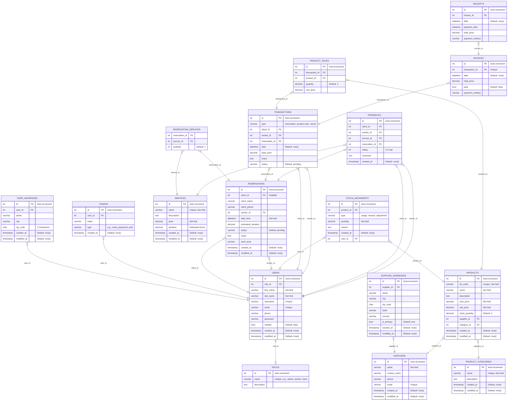

# Instruccions per aixecar el projecte

Per aixecar el projecte cal seguir els següents passos:

**Nota:** Si no has creat un enllaç simbòlic per a `sail`, hauràs d'executar les ordres amb la ruta completa `./vendor/bin/sail`. Si ja tens l'enllaç configurat dins `source.bash`, simplement usa `sail` directament.

---

## 1. Instal·lar Laravel Sail

Per instal·lar les dependències del projecte i Laravel Sail, executa la següent instrucció:

```
docker run --rm \
    -u "$(id -u):$(id -g)" \
    -v "$(pwd):/var/www/html" \
    -w /var/www/html \
    laravelsail/php84-composer:latest \
    composer install --ignore-platform-reqs
```

Més informació sobre la instal·lació de Laravel Sail a la documentació oficial: [Laravel Sail](https://laravel.com/docs/11.x/sail#installing-composer-dependencies-for-existing-projects).

---

## 2. Iniciar els contenidors de Laravel Sail

Després d'instal·lar Sail, inicia els contenidors amb:

```
sail up -d
```

Aquest comandament aixecarà tots els serveis definits a `docker-compose.yml` en mode **desatès** (`-d`).

---

## 3. Executar les migracions i sembrar la base de dades

Per executar les migracions i afegir dades inicials, fes:

```
sail artisan migrate --seed
```

Això crearà les taules necessàries i omplirà la base de dades amb dades predefinides.

---

## 4. Crear l'enllaç simbòlic per a la carpeta d'emmagatzematge

Laravel utilitza la carpeta `storage/app/public/` per emmagatzemar fitxers públics. Per assegurar que aquests fitxers siguin accessibles des de `public/storage/`, cal crear un enllaç simbòlic executant:

```
sail artisan storage:link
```

Això permetrà que els fitxers emmagatzemats a `storage/app/public/` siguin accessibles des del navegador.

---

## 5. Compilar els assets amb Tailwind CSS

Si el projecte utilitza Tailwind CSS, cal compilar els assets executant:

```
sail npm run dev
```

Això generà els arxius CSS i JavaScript necessaris per a l'aplicació.

Si vols que els assets es regenerin automàticament quan modifiquis els fitxers, pots utilitzar:

```
sail npm run watch
```

---

## 6. Accedir a l'aplicació

Un cop aixecat el projecte, pots accedir-hi mitjançant el teu navegador a:

```
http://localhost
```

Si l'aplicació no carrega correctament, revisa si el contenidor està en marxa amb:

```
sail ps
```

Per aturar l'entorn, pots utilitzar:

```
sail down
```

---

Amb aquests passos, el projecte hauria d'estar llest per funcionar! 🚀


# Enllaç video youtube
https://youtu.be/HJfwBxi8IA8



## Explicacio projecte

Abans de res per poder fer les migrations i tot plegat, s'ha d'activar el següent al mysql, un cop fetes les migracions, s'haurà de desactivar:
```mysql
SET GLOBAL log_bin_trust_function_creators = 1;
-- Fer migració
SET GLOBAL log_bin_trust_function_creators = 0;
```

Les contrasenyes per defecte son `password` i l'admin és `admin`.

# 📋 **Sistema de Gestió Integral**

## **Descripció del projecte**
Aquesta aplicació és un **sistema de gestió integral** dissenyat per gestionar **usuaris**, **treballadors**, **reserves**, **serveis**, **productes** i **transaccions**. La solució està orientada a negocis que requereixen una plataforma centralitzada per administrar clients, serveis i vendes.

---

## 🚀 **Funcionalitats principals**

### 🔹 **Gestió d'Usuaris i Rols**
- **Rols disponibles**: `admin`, `worker`, `client`.
- **Funcions per usuari**:
    - **Clients** poden fer reserves i donar feedback.
    - **Treballadors** gestionen reserves i transaccions.
    - **Administradors** tenen accés total a totes les funcionalitats.
- **Dades gestionades**: *nom*, *cognoms*, *email*, *nom d'usuari*, *telèfon*, *contrasenya* i estat de verificació.

### 🔹 **Gestió de Reserves**
- Creació de **reserves** associades a:
    - **Clients registrats** o **clients no registrats** (nom i telèfon manual).
    - **Treballadors assignats**.
- Possibilitat d'afegir **serveis** amb quantitats i duracions estimades.
- Camps clau: *data i hora*, *estat* (`pending`, `confirmed`, `completed`, `cancelled`), i *notes*.

### 🔹 **Gestió de Serveis i Proveïdors**
- **Serveis**: inclouen nom, descripció, preu i durada.
- **Proveïdors**: poden tenir múltiples adreces.
- **Productes**: gestionats per categories, amb preus i quantitats d'estoc controlades.

### 🔹 **Gestió de Transaccions i Facturació**
- Creació de **transaccions** per:
    - Reserves.
    - Vendes de productes.
    - Combinació de serveis i productes.
- Generació de **factures** i **rebuts** amb seguiment d'estats (`pending`, `paid`, `cancelled`).

### 🔹 **Gestió de Feedback**
- Clients poden valorar serveis i treballadors amb:
    - **Valoració d'estrelles** (1-5).
    - **Comentaris opcionals**.

---

## 🛠️ **Tecnologies utilitzades**

| Tecnologia       | Descripció                                 |
|------------------|-------------------------------------------|
| **Laravel**      | Framework PHP per gestionar el backend.   |
| **MySQL**        | Base de dades relacional.                 |
| **Tailwind CSS** | Framework de disseny responsive modern.   |
| **Blade**        | Motor de plantilles de Laravel.           |
| **FullCalendar** | Llibreria per gestionar calendaris.       |
| **JavaScript**   | Interacció dinàmica al frontend.          |

---
